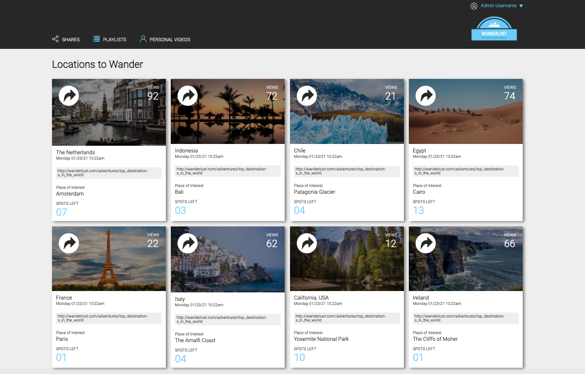
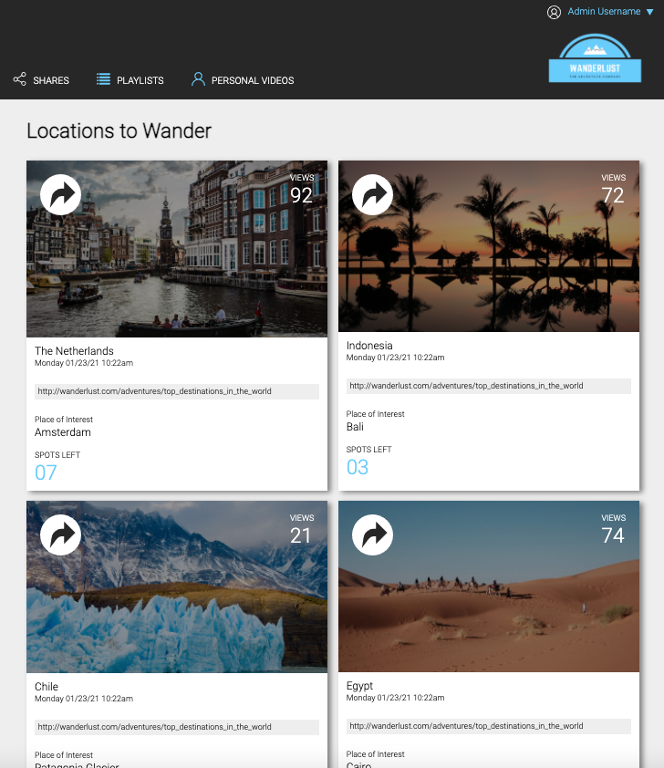
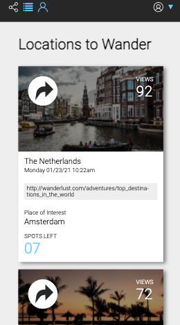

# Static Comp Challenge

The challenge is to become a CSS wizard by matching the given comp with HTML and CSS. A little creative freedom was allowed, permitting me to create a travel website instead of the details provided in the comp.

The website is also completely responsive, enabling those browsing the web on tablets or mobile devices to view this page.

## Launch

View the program on GitHub pages -> 
https://aemiers.github.io/static-comp-challenge/

OR 

Clone the repo to your local machine and launch the index.html file in your browser.

## Technology Used

1. HTML
2. CSS
3. Google
4. PixelZoomer

## Recreation
### Given Comp

### Recreated Version with a Twist

### Responsive Tablet View

### Responsive Mobile View

## Contributing
Anneke Miers (www.github.com/aemiers)
